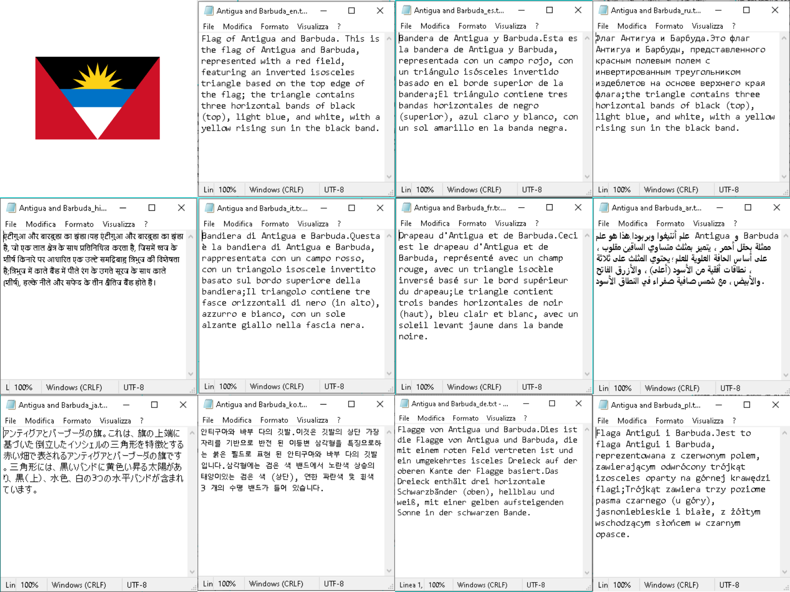

# Caption Translator

This Python script helps you validate and translate auto-generated caption files (e.g., from Flux Gym or Civitai) into a target language of your choice. It ensures all text files are in UTF-8 encoding and produces translated versions with language-specific suffixes.

## 📁 Folder Structure

```
Caption_Translator/
├── Caption_Translator.py
├── requirements.txt
├── put_here_image_and_caption/
│   ├── 001.txt
│   ├── 001.jpg / 001.png
│   ├── translation/    # Translations are saved here
│   │   ├── 001_it.txt
│   │   └── ...
│   └── ...
└── venv/ (optional virtual environment)
```

## ⚙️ Features

- Works in the local folder where it's placed
- Ensures all `.txt` files are encoded in UTF-8
- Translates each caption into a selected language
- Original files remain unchanged
- Creates new files like `001_it.txt`, `002_fr.txt`, etc. in the `translation` subfolder

## 🚀 Installation (with virtual environment)

### Windows

```bash
python -m venv venv
venv\Scripts\activate
python.exe -m pip install --upgrade pip
pip install wheel
pip install -r requirements.txt
```

### macOS / Linux

```bash
python3 -m venv venv
source venv/bin/activate
python -m pip install --upgrade pip
pip install wheel
pip install -r requirements.txt
```

## 📌 Usage

1. Create a `requirements.txt` file with the following content:
   ```
   googletrans==4.0.0-rc1
   chardet
   ```

2. Place your `.txt` caption files (and optionally corresponding images) inside the `put_here_image_and_caption` folder.
3. Run the script using this command:

```bash
python Caption_Translator.py --lang it
```

Replace `it` with your desired target language code (e.g. `en`, `fr`, `de`, `es`, `zh`, etc.).

## 📝 Output

For each file like `001.txt`, a translated file such as `001_it.txt` will be created in the `translation` subfolder.


## 📄 License

Free to use. No paid APIs or services are required.
